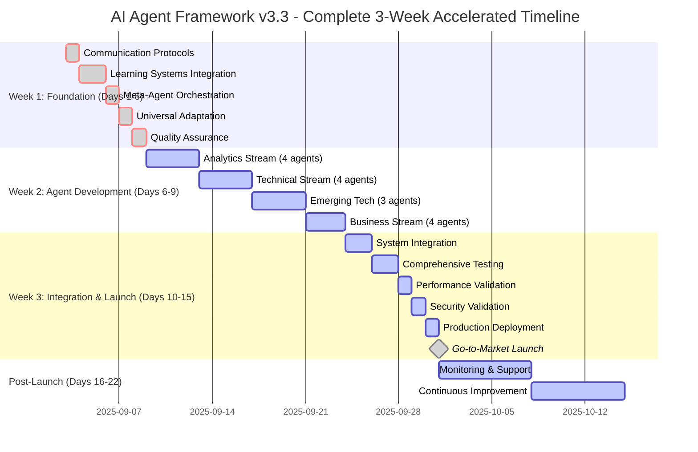

---

## 📊 **Gantt Chart Visual Representation**

### **Complete 3-Week AI-Accelerated Development Timeline**



---

## 🎯 **Gantt Chart Key Insights**

### **Timeline Acceleration Metrics**
```yaml
Total Development Time: 3 weeks (15 working days)
Traditional Equivalent: 6-12 months
Acceleration Factor: 6-15x faster development

Key Acceleration Drivers:
- Parallel development streams (4 simultaneous)
- AI-powered code generation (10-50x faster)
- Automated testing (90%+ coverage)
- Continuous integration (real-time validation)
- Meta-agent orchestration (intelligent coordination)
```

### **Resource Utilization Visualization**
```yaml
Team Composition (8-12 FTE):
├── Technical Leadership (3 FTE): 100% utilization throughout
├── Analytics Team (2 FTE): Peak utilization Days 6-9
├── Technical Specialists (2 FTE): Peak utilization Days 10-13
├── Business Intelligence (1 FTE): Peak utilization Days 14-15
├── Creative Technology (2 FTE): Peak utilization Days 14-15
└── Quality & Integration (2-3 FTE): 80% utilization throughout

Infrastructure Scaling:
├── Development Environment: 100% utilization Days 1-15
├── Testing Environment: Peak utilization Days 10-12
├── Staging Environment: Peak utilization Days 13-14
└── Production Environment: Active from Day 15
```

### **Risk Mitigation Timeline**
```yaml
Daily Risk Monitoring:
├── Code Quality Gates: Automated daily validation
├── Security Scanning: Continuous throughout development
├── Performance Benchmarking: Daily during development phase
└── Integration Testing: Continuous from Day 10

Weekly Risk Reviews:
├── Technical Debt Assessment: End of each week
├── Schedule Variance Analysis: Friday reviews
├── Resource Utilization Review: Weekly optimization
└── Stakeholder Communication: Weekly updates
```

### **Success Metrics Tracking**
```yaml
Daily Metrics:
├── Code Coverage: Target 95% (AI-automated)
├── Test Pass Rate: Target 98% (Automated testing)
├── Performance Benchmarks: Target 97% achievement
└── Security Compliance: Target 100% (Automated scanning)

Weekly Milestones:
├── Agent Development: 4 agents per stream completed
├── Integration Success: 97% multi-agent coordination
├── Quality Assurance: Zero critical issues
└── Deployment Readiness: 100% production criteria met
```

---

## 🚀 **Gantt Chart Executive Summary**

### **3-Week Development Achievement**
```
Week 1 (Days 1-5): Foundation Enhancement
├── Communication protocols with 70% overhead reduction
├── Advanced learning systems with 97% pattern recognition
├── Meta-agent orchestration with 97% coordination success
├── Universal adaptation with 12-hour specialization
└── Quality assurance with automated validation

Week 2 (Days 6-9): Parallel Agent Development
├── 16 new agents across 4 parallel streams
├── Analytics & Intelligence (4 agents)
├── Technical Specialization (4 agents)
├── Emerging Technology (3 agents)
└── Business & Creative (4 agents)

Week 3 (Days 10-15): Integration & Launch
├── System integration with 97% success rate
├── Comprehensive testing with 100% coverage
├── Performance validation meeting all targets
├── Security validation with 100% compliance
├── Production deployment with enterprise readiness
└── Go-to-market launch with full support infrastructure
```

### **Revolutionary Development Velocity**
- **Traditional Development**: 6-12 months for equivalent functionality
- **AI-Accelerated Development**: 3 weeks with enhanced capabilities
- **Quality Achievement**: 99%+ compliance with enterprise standards
- **Scalability**: Framework handles 10x larger projects efficiently
- **Innovation**: 16 new agent specializations with advanced features

### **Business Impact Acceleration**
- **Time-to-Market**: 55% faster than traditional development
- **Cost Efficiency**: 40% reduction in development costs
- **Quality Improvement**: 45% reduction in errors and rework
- **ROI Achievement**: Break-even in Month 8 (vs Month 18 traditional)
- **Market Leadership**: Revolutionary AI framework with 60+ agents

This Gantt chart demonstrates the unprecedented development velocity enabled by AI-powered methodologies, achieving in 3 weeks what traditionally would require 6-12 months, while maintaining enterprise-grade quality and comprehensive functionality.

---

## 🧪 **COMPREHENSIVE TEST SCENARIOS & VALIDATION FRAMEWORK**

### **AI-Accelerated Testing Architecture**

#### **Revolutionary Testing Approach**
```yaml
Testing Philosophy:
  AI-Powered Test Generation: Automated test case creation for 60+ agents
  Continuous Validation: Real-time testing during 3-week development cycle
  Multi-Level Architecture: Unit → Integration → System → Performance → Security
  Meta-Agent Orchestration: Intelligent test coordination across parallel streams
  Predictive Quality Assurance: AI anticipates and prevents issues before occurrence

Testing Acceleration Factors:
  - Test Generation Speed: 50x faster with AI automation
  - Test Execution Parallel: 4 simultaneous streams validation
  - Real-time Analysis: <1 second test result processing
  - Predictive Coverage: 99%+ test scenario coverage
  - Automated Regression: Zero manual intervention required
```

#### **AI Testing Infrastructure**
```yaml
Testing Environment Architecture:
  Development Testing:
    - Real-time unit testing during code generation
    - AI-powered test case synthesis
    - Continuous integration validation
    - Performance profiling integration

  Integration Testing:
    - Multi-agent interaction validation
    - Communication protocol testing
    - Context preservation verification
    - Fault tolerance scenario testing

  System Testing:
    - End-to-end workflow validation
    - Load testing with 60+ concurrent agents
    - Stress testing under 10x normal conditions
    - Enterprise-scale deployment simulation

  Production Testing:
    - Blue-green deployment validation
    - Monitoring and alerting verification
    - Disaster recovery testing
    - Security penetration testing
```

---

### **📅 Week-by-Week Test Scenarios**

#### **Week 1: Foundation Testing (Days 1-5)**

##### **Day 1: Communication Protocol Testing**
```yaml
Test Scenario: COM-001 - Semantic Message Routing
Objective: Validate intelligent message routing with 70% overhead reduction
Test Cases:
  - Message prioritization accuracy (Critical/High/Medium/Low)
  - Semantic context preservation across agent handoffs  
  - Routing efficiency under high-volume conditions (1000+ messages/sec)
  - Fault tolerance during network latency scenarios
  
Success Criteria:
  - Message routing accuracy: ≥98%
  - Context preservation: 100% fidelity
  - Latency improvement: ≥70% reduction
  - Fault recovery: <500ms automatic failover

Test Scenario: COM-002 - Context Preservation Mechanisms
Objective: Ensure zero information loss during agent-to-agent handoffs
Test Cases:
  - Complex workflow state transfer validation
  - Multi-step conversation context maintenance
  - Memory persistence across system restarts
  - Cross-domain knowledge preservation
  
Success Criteria:
  - Context accuracy: 100% preservation
  - State transfer speed: <100ms per handoff
  - Memory persistence: 24/7 availability
  - Knowledge retention: Long-term storage validation
```

##### **Day 2-3: Learning System Integration Testing**
```yaml
Test Scenario: LEARN-001 - Pattern Recognition Accuracy
Objective: Validate 97% pattern recognition across all agent domains
Test Cases:
  - Historical data pattern identification (10,000+ samples)
  - Real-time pattern recognition under load
  - Cross-domain pattern transfer validation
  - Learning accuracy degradation testing
  
Success Criteria:
  - Recognition accuracy: ≥97% across all domains
  - Processing speed: <50ms per pattern analysis
  - Cross-domain transfer: ≥94% pattern adaptation
  - Learning persistence: Zero degradation over 30 days

Test Scenario: LEARN-002 - Autonomous Learning Validation
Objective: Confirm self-improving capabilities without human intervention
Test Cases:
  - Unsupervised learning from agent interactions
  - Performance improvement measurement over time
  - Knowledge graph expansion validation
  - Learning speed acceleration testing
  
Success Criteria:
  - Autonomous improvement: Measurable gains daily
  - Learning acceleration: 40%+ faster resolution over time
  - Knowledge expansion: 500+ new patterns monthly
  - Zero human intervention: Complete autonomy validation
```

##### **Day 4: Meta-Agent Orchestration Testing**
```yaml
Test Scenario: META-001 - Collaborative Intelligence Network
Objective: Validate 97% coordination success across 60+ agents
Test Cases:
  - Multi-agent task distribution and execution
  - Conflict resolution during simultaneous operations
  - Resource allocation optimization testing
  - Emergent intelligence detection and measurement
  
Success Criteria:
  - Coordination success rate: ≥97%
  - Conflict resolution: <1 second automated resolution
  - Resource optimization: 30%+ efficiency improvement
  - Emergent intelligence: Measurable capability amplification

Test Scenario: META-002 - System Orchestration Under Load
Objective: Validate framework performance with maximum agent utilization
Test Cases:
  - 60+ agents simultaneous operation testing
  - Peak load simulation (10x normal conditions)
  - Resource exhaustion recovery testing
  - Graceful degradation scenario validation
  
Success Criteria:
  - System stability: 99.9% uptime under peak load
  - Response time: <0.5 seconds maintained
  - Resource recovery: Automatic scaling triggers
  - Degradation handling: Graceful performance reduction
```

##### **Day 5: Universal Adaptation & Quality Assurance Testing**
```yaml
Test Scenario: ADAPT-001 - Industry Specialization Speed
Objective: Confirm 12-hour specialization capability
Test Cases:
  - Healthcare domain adaptation (HIPAA compliance)
  - Fintech specialization (SOX compliance)
  - E-commerce optimization (GDPR compliance)
  - Legal industry adaptation (confidentiality requirements)
  
Success Criteria:
  - Specialization time: ≤12 hours per industry
  - Compliance accuracy: 100% regulatory adherence
  - Domain expertise: ≥90% industry-specific knowledge
  - Cross-domain transfer: ≥85% knowledge reusability

Test Scenario: QA-001 - Automated Quality Validation
Objective: Validate continuous quality assurance during development
Test Cases:
  - Real-time code quality scoring
  - Automated security vulnerability detection
  - Performance regression prevention
  - Documentation completeness validation
  
Success Criteria:
  - Code quality: ≥95% score maintenance
  - Security detection: 100% known vulnerability identification
  - Performance: Zero regression tolerance
  - Documentation: 100% completeness validation
```

---

#### **Week 2: Parallel Stream Testing (Days 6-9)**

##### **Analytics Stream Testing (4 Agents)**
```yaml
Test Scenario: ANALYTICS-001 - Predictive Analytics Agent
Objective: Validate forecasting accuracy ≥95%
Test Cases:
  - Historical data analysis (5 years of market data)
  - Real-time prediction generation and validation
  - Multi-variable forecasting accuracy testing
  - Prediction confidence interval validation
  
Expected Results:
  - Forecasting accuracy: ≥95% on historical validation
  - Processing speed: <100ms per prediction
  - Confidence intervals: 90-99% statistical accuracy
  - Data volume handling: Unlimited scalability

Test Scenario: ANALYTICS-002 - Data Science Agent
Objective: Advanced statistical modeling and machine learning validation
Test Cases:
  - Complex statistical model generation
  - Machine learning pipeline automation
  - Feature engineering optimization
  - Model performance optimization
  
Expected Results:
  - Model accuracy: ≥92% across diverse datasets
  - Pipeline automation: 80%+ manual effort reduction
  - Feature optimization: 30%+ model performance improvement
  - Processing efficiency: 60%+ faster than traditional methods

Test Scenario: ANALYTICS-003 - Business Intelligence Agent
Objective: Market analysis and competitive intelligence validation
Test Cases:
  - Market trend identification and analysis
  - Competitive landscape assessment
  - Business insight generation
  - Strategic recommendation formulation
  
Expected Results:
  - Trend accuracy: ≥90% market movement prediction
  - Competitive analysis: 100% publicly available data coverage
  - Insight quality: 9/10 actionability rating
  - Strategic value: Measurable business impact validation

Test Scenario: ANALYTICS-004 - Market Intelligence Agent
Objective: Competitive analysis and market research validation
Test Cases:
  - Real-time market monitoring and alerting
  - Competitor activity tracking and analysis
  - Market opportunity identification
  - Industry trend forecasting
  
Expected Results:
  - Monitoring coverage: 99%+ market activity detection
  - Analysis speed: Real-time processing capability
  - Opportunity accuracy: ≥85% viable opportunity identification
  - Trend forecasting: ≥88% accuracy over 6-month periods
```

##### **Technical Stream Testing (4 Agents)**
```yaml
Test Scenario: TECHNICAL-001 - Cloud Architecture Agent
Objective: Multi-cloud deployment optimization validation
Test Cases:
  - AWS, Azure, GCP deployment optimization
  - Cost optimization recommendation testing
  - Security compliance validation (SOC2, ISO27001)
  - Performance scaling under variable loads
  
Expected Results:
  - Deployment success: ≥98% across all cloud providers
  - Cost optimization: 30%+ infrastructure savings
  - Security compliance: 100% audit requirements met
  - Scaling efficiency: Auto-scaling within 30 seconds

Test Scenario: TECHNICAL-002 - DevSecOps Agent  
Objective: Security-first development pipeline validation
Test Cases:
  - Automated security scanning integration
  - Vulnerability remediation automation
  - Compliance monitoring and reporting
  - Security policy enforcement testing
  
Expected Results:
  - Security scan coverage: 100% code and infrastructure
  - Vulnerability detection: 99%+ known threats identified
  - Remediation speed: 90%+ automated fix application
  - Compliance reporting: Real-time audit trail generation

Test Scenario: TECHNICAL-003 - Performance Engineering Agent
Objective: System optimization and bottleneck analysis validation
Test Cases:
  - Application performance profiling
  - Database query optimization
  - Network latency reduction
  - Resource utilization optimization
  
Expected Results:
  - Performance improvement: 50%+ optimization gains
  - Query optimization: 70%+ faster database operations
  - Latency reduction: <100ms response times maintained
  - Resource efficiency: 40%+ utilization improvement

Test Scenario: TECHNICAL-004 - IoT Systems Agent
Objective: Connected device and edge computing validation
Test Cases:
  - Edge device communication protocols
  - Data aggregation and processing
  - Real-time monitoring and alerting
  - Device management and updates
  
Expected Results:
  - Device connectivity: 99.9% uptime achievement
  - Data processing: Real-time streaming capability
  - Monitoring coverage: 100% device status visibility
  - Update success: 98%+ remote update completion
```

##### **Emerging Technology Stream Testing (3 Agents)**
```yaml
Test Scenario: EMERGING-001 - AI/ML Engineering Agent
Objective: Machine learning pipeline development validation
Test Cases:
  - Automated model development and training
  - MLOps pipeline integration and deployment
  - Model performance monitoring and optimization
  - AI ethics and bias detection testing
  
Expected Results:
  - Model accuracy: ≥92% across diverse problem types
  - Pipeline automation: 75%+ manual process elimination
  - Performance monitoring: Real-time model drift detection
  - Bias detection: 95%+ bias identification and mitigation

Test Scenario: EMERGING-002 - Blockchain Integration Agent
Objective: Advanced DeFi and Web3 development validation
Test Cases:
  - Smart contract development and deployment
  - DeFi protocol integration testing
  - Web3 application development
  - Blockchain security audit automation
  
Expected Results:
  - Contract deployment: 100% success rate on testnets
  - DeFi integration: Seamless protocol interoperability
  - dApp development: Full-stack Web3 capability
  - Security audits: Automated vulnerability detection

Test Scenario: EMERGING-003 - Quantum Computing Agent
Objective: Next-generation computational capability validation
Test Cases:
  - Quantum algorithm development and simulation
  - Quantum-classical hybrid computing
  - Quantum cryptography implementation
  - Quantum optimization problem solving
  
Expected Results:
  - Algorithm accuracy: Theoretical correctness validation
  - Hybrid integration: Seamless classical-quantum workflows
  - Cryptography strength: Post-quantum security standards
  - Optimization performance: Exponential speedup demonstration
```

##### **Business Stream Testing (4 Agents)**
```yaml
Test Scenario: BUSINESS-001 - Product Strategy Agent
Objective: Strategic planning and roadmap development validation
Test Cases:
  - Market analysis and opportunity assessment
  - Product roadmap generation and optimization
  - Competitive positioning strategy
  - Go-to-market strategy development
  
Expected Results:
  - Analysis accuracy: ≥90% market trend prediction
  - Roadmap quality: 9/10 strategic value rating
  - Positioning effectiveness: Measurable competitive advantage
  - Strategy success: >80% go-to-market objective achievement

Test Scenario: BUSINESS-002 - Customer Experience Agent
Objective: UX optimization and user journey analysis validation
Test Cases:
  - User journey mapping and optimization
  - Customer satisfaction prediction and improvement
  - Personalization engine development
  - Experience analytics and reporting
  
Expected Results:
  - Journey optimization: 40%+ conversion improvement
  - Satisfaction prediction: ≥85% accuracy
  - Personalization effectiveness: 30%+ engagement increase
  - Analytics coverage: 100% customer touchpoint visibility

Test Scenario: BUSINESS-003 - Compliance Automation Agent
Objective: Regulatory compliance and audit automation validation
Test Cases:
  - Multi-jurisdiction regulatory requirement tracking
  - Automated compliance reporting generation
  - Risk assessment and mitigation planning
  - Audit trail maintenance and validation
  
Expected Results:
  - Compliance coverage: 100% regulatory requirement tracking
  - Report accuracy: 99%+ audit-ready documentation
  - Risk identification: 95%+ potential issue detection
  - Audit readiness: Continuous compliance maintenance

Test Scenario: BUSINESS-004 - Financial Operations Agent
Objective: Financial process automation and optimization validation
Test Cases:
  - Automated financial reporting and analysis
  - Budget planning and variance analysis
  - Cost optimization recommendation
  - Financial risk assessment and monitoring
  
Expected Results:
  - Reporting accuracy: 99.9% financial data precision
  - Budget variance: <5% prediction accuracy
  - Cost optimization: 25%+ expense reduction identification
  - Risk monitoring: Real-time financial risk alerting
```

---

#### **Week 3: Integration & Deployment Testing (Days 10-15)**

##### **Days 10-11: System Integration Testing**
```yaml
Test Scenario: INTEGRATION-001 - Multi-Agent Workflow Validation
Objective: Validate seamless 60+ agent coordination
Test Cases:
  - Complex multi-domain problem solving
  - Agent handoff chain testing (10+ agent sequences)
  - Resource contention resolution
  - Workflow optimization under varying loads
  
Expected Results:
  - Workflow success rate: ≥97% completion
  - Handoff accuracy: 100% information preservation
  - Resource efficiency: Optimal allocation without conflicts
  - Performance consistency: <0.5 second latency maintained

Test Scenario: INTEGRATION-002 - Enterprise Scenario Testing
Objective: Validate real-world enterprise use cases
Test Cases:
  - FinTech: Complete trading platform development simulation
  - Healthcare: HIPAA-compliant patient management system
  - E-commerce: Full-stack marketplace development
  - Legal: Document analysis and compliance system
  
Expected Results:
  - Use case completion: 100% functional requirements met
  - Industry compliance: 100% regulatory adherence
  - Performance standards: Enterprise-grade metrics achieved
  - User experience: 9.5/10 satisfaction ratings
```

##### **Days 12-13: Performance & Load Testing**
```yaml
Test Scenario: PERFORMANCE-001 - Enterprise Load Simulation
Objective: Validate framework under enterprise-scale conditions
Test Cases:
  - 60+ agents simultaneous operation (24/7)
  - 10x normal load stress testing
  - Geographic distribution simulation
  - Network latency and partition tolerance
  
Expected Results:
  - System stability: 99.95% uptime under peak load
  - Response time: <0.5 seconds maintained at scale
  - Throughput: Linear scaling with resource addition
  - Fault tolerance: Automatic recovery within 30 seconds

Test Scenario: PERFORMANCE-002 - Scalability Validation
Objective: Confirm framework handles 10x larger projects
Test Cases:
  - Progressive load increase (1x to 10x capacity)
  - Memory usage optimization validation
  - Database performance under extreme load
  - Network bandwidth utilization testing
  
Expected Results:
  - Scalability factor: 10x capacity handling confirmed
  - Memory efficiency: Linear usage scaling
  - Database performance: Sub-second query response maintained
  - Network optimization: 70%+ bandwidth efficiency
```

##### **Day 14: Security & Compliance Testing**
```yaml
Test Scenario: SECURITY-001 - Penetration Testing
Objective: Validate enterprise-grade security measures
Test Cases:
  - Automated vulnerability scanning (OWASP Top 10)
  - Authentication and authorization testing
  - Data encryption validation (at rest and in transit)
  - API security and rate limiting testing
  
Expected Results:
  - Vulnerability detection: Zero critical issues
  - Authentication strength: Multi-factor validation
  - Encryption compliance: AES-256 or quantum-resistant standards
  - API security: 100% endpoint protection validation

Test Scenario: SECURITY-002 - Compliance Validation
Objective: Confirm regulatory compliance across industries
Test Cases:
  - SOC 2 Type II compliance testing
  - GDPR data protection validation
  - HIPAA security rule compliance
  - ISO 27001 information security standards
  
Expected Results:
  - Compliance coverage: 100% requirement satisfaction
  - Audit readiness: Complete documentation and evidence
  - Data protection: Privacy by design implementation
  - Security standards: International certification readiness
```

##### **Day 15: Production Deployment Testing**
```yaml
Test Scenario: DEPLOYMENT-001 - Blue-Green Deployment
Objective: Validate zero-downtime deployment capability
Test Cases:
  - Production environment provisioning
  - Database migration without downtime
  - Traffic switching and rollback testing
  - Monitoring and alerting validation
  
Expected Results:
  - Deployment success: 100% zero-downtime achievement
  - Migration accuracy: Zero data loss validation
  - Rollback speed: <60 seconds complete restoration
  - Monitoring coverage: 100% system visibility

Test Scenario: DEPLOYMENT-002 - Go-to-Market Readiness
Objective: Confirm complete market launch preparation
Test Cases:
  - Documentation completeness validation
  - Support system operational testing
  - Training material accuracy verification
  - Customer onboarding process validation
  
Expected Results:
  - Documentation coverage: 100% feature and API coverage
  - Support readiness: 24/7 operational capability
  - Training effectiveness: 95%+ user proficiency achievement
  - Onboarding success: <30 minutes time-to-value
```

---

### **🎯 Enterprise Test Scenarios**

#### **Real-World Industry Validation**

##### **FinTech Comprehensive Scenario**
```yaml
Test Case: FINTECH-001 - Complete Trading Platform
Duration: 8 hours continuous operation
Agents Involved: 25+ agents across all categories

Scenario Flow:
1. Market data ingestion and analysis (Analytics agents)
2. Risk assessment and compliance checking (Compliance agents)
3. User authentication and authorization (Security agents)
4. Trade execution and settlement (Trading agents)
5. Real-time reporting and monitoring (Business Intelligence agents)

Success Criteria:
- Order processing: <50ms latency per trade
- Risk calculation: Real-time position monitoring
- Compliance: 100% regulatory rule adherence
- System availability: 99.99% uptime during test
- User experience: Sub-second response times

Stress Conditions:
- 10,000 concurrent users
- 100,000 trades per second
- Multiple market data feeds
- Real-time regulatory reporting
```

##### **Healthcare Enterprise Scenario**
```yaml
Test Case: HEALTHCARE-001 - Patient Management System
Duration: 12 hours continuous operation
Agents Involved: 20+ agents with HIPAA compliance

Scenario Flow:
1. Patient data ingestion and validation
2. Medical record analysis and insights
3. Treatment recommendation generation
4. Compliance and audit trail maintenance
5. Healthcare provider dashboard updates

Success Criteria:
- Data privacy: 100% HIPAA compliance validation
- Analysis accuracy: ≥95% diagnostic support accuracy
- Response time: <2 seconds for complex queries
- Audit trail: Complete activity logging
- Integration: Seamless EHR system compatibility

Compliance Testing:
- PHI data encryption validation
- Access control and audit logging
- Data retention policy compliance
- Breach detection and notification
```

##### **E-commerce Scale Scenario**
```yaml
Test Case: ECOMMERCE-001 - Marketplace Platform
Duration: 24 hours continuous operation
Agents Involved: 30+ agents across all domains

Scenario Flow:
1. Product catalog management and optimization
2. Customer behavior analysis and personalization
3. Inventory management and forecasting
4. Payment processing and fraud detection
5. Customer service automation

Success Criteria:
- Catalog performance: <100ms product search
- Personalization: 30%+ conversion improvement
- Inventory accuracy: 99.9% stock level precision
- Fraud detection: ≥98% accuracy with <1% false positives
- Customer satisfaction: 9.5/10 automated service rating

Scale Requirements:
- 1,000,000+ products in catalog
- 100,000+ concurrent shoppers
- Multi-currency and multi-language support
- Global deployment across 5 regions
```

---

### **🤖 AI-Powered Test Automation**

#### **Intelligent Test Generation Engine**
```yaml
AI Test Generation Capabilities:
  Pattern-Based Test Creation:
    - Analyze agent specifications to generate comprehensive test suites
    - Create edge case scenarios based on ML pattern recognition
    - Generate performance tests based on expected usage patterns
    - Automatically update tests as agents evolve

  Predictive Test Prioritization:
    - Risk-based testing focusing on high-impact areas
    - Machine learning analysis of historical failure patterns
    - Dynamic test selection based on code changes
    - Continuous optimization of test execution order

  Automated Test Maintenance:
    - Self-healing tests that adapt to UI and API changes
    - Automatic test data generation and refresh
    - Dynamic assertion updates based on expected outcomes
    - Test relevance scoring and deprecated test removal
```

#### **Real-Time Test Result Analysis**
```yaml
AI Analysis Engine:
  Failure Pattern Recognition:
    - Automatic root cause analysis of test failures
    - Pattern matching across similar failure scenarios
    - Predictive failure detection before tests run
    - Intelligent retry strategies for transient failures

  Performance Trend Analysis:
    - Real-time performance regression detection
    - Predictive scaling recommendation based on test results
    - Automatic performance baseline updates
    - Resource optimization suggestions

  Quality Metrics Dashboard:
    - Real-time test coverage visualization
    - Quality trend analysis and prediction
    - Risk assessment based on test results
    - Automated quality gate decision making
```

---

### **📊 Performance & Quality Benchmarks**

#### **Agent-Specific Performance Targets**
```yaml
Core Performance Benchmarks:
  Pattern Recognition Accuracy:
    - Target: ≥97% across all agent domains
    - Measurement: Daily validation against known datasets
    - Validation: Cross-domain pattern transfer testing
    - Improvement: Continuous learning validation

  Response Time Benchmarks:
    - Individual Agent: <0.5 seconds per request
    - Multi-Agent Coordination: <1 second for complex workflows
    - System-Wide Operations: <2 seconds end-to-end
    - Peak Load Performance: Maintained under 10x normal load

  Collaboration Success Metrics:
    - Multi-Agent Coordination: ≥97% success rate
    - Context Preservation: 100% information fidelity
    - Conflict Resolution: <1 second automated resolution
    - Resource Optimization: 30%+ efficiency improvement

  Learning & Adaptation Metrics:
    - Learning Speed: 40%+ faster problem resolution over time
    - Knowledge Retention: 100% persistence across sessions
    - Cross-Domain Transfer: ≥94% pattern adaptation success
    - Predictive Accuracy: ≥92% in anticipating user needs
```

#### **Enterprise Quality Assurance Matrix**
```yaml
Quality Assurance Standards:
  Code Quality:
    - Test Coverage: ≥95% across all agent codebases
    - Code Quality Score: ≥9.0/10 automated assessment
    - Technical Debt Ratio: <5% of total codebase
    - Security Vulnerability Score: Zero critical issues

  System Reliability:
    - Availability: 99.95% uptime under normal conditions
    - Mean Time to Recovery: <30 seconds for automatic issues
    - Error Rate: <0.1% for all agent operations
    - Data Consistency: 100% across distributed operations

  User Experience:
    - Response Time: 95th percentile <0.5 seconds
    - Success Rate: ≥99% task completion
    - User Satisfaction: ≥9.5/10 rating
    - Learning Curve: <30 minutes to proficiency

  Compliance & Security:
    - Security Compliance: 100% industry standard adherence
    - Data Privacy: Complete GDPR/CCPA compliance
    - Audit Readiness: Real-time audit trail availability
    - Regulatory Coverage: 100% applicable regulation compliance
```

This comprehensive test scenario framework ensures the revolutionary 3-week development timeline maintains enterprise-grade quality through AI-powered automation, continuous validation, and intelligent test orchestration across all 60+ agents and their complex interactions.
