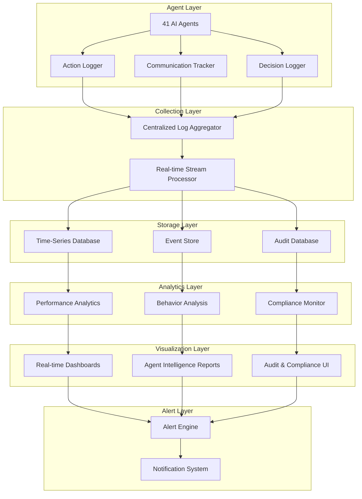
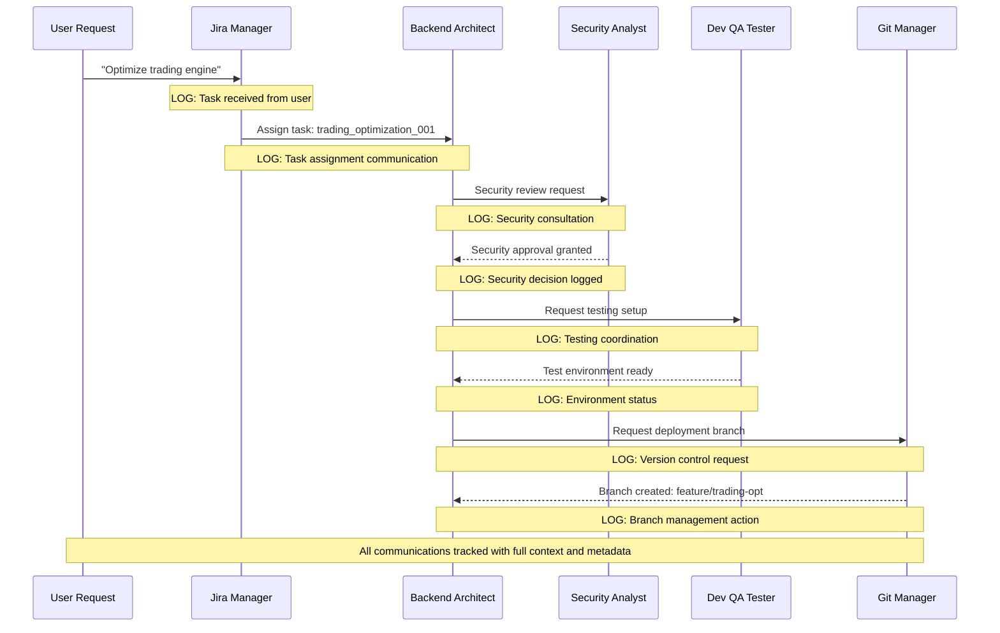

# AI Agent Actions Log & Monitoring System
**Version**: 1.0  
**Last Updated**: 2025-08-27  
**Status**: Enterprise-Grade Monitoring Framework  

---

## 🎯 **Overview**

A comprehensive real-time monitoring, logging, and audit system for tracking all AI agent activities, communications, decisions, and performance metrics across the entire crypto exchange development ecosystem.

**Vision**: Complete transparency, accountability, and operational intelligence for all 41 AI agents with enterprise-grade security and compliance.

---

## 🏗️ **System Architecture**

### **Core Components**



---

## 📊 **Agent Actions Logging Framework**

### **1. Action Classification System**

#### **🔴 Critical Actions** (Immediate Logging + Alert)
```json
{
  "action_type": "critical",
  "categories": [
    "security_decision",
    "compliance_violation_detected", 
    "production_deployment",
    "emergency_response",
    "financial_transaction",
    "user_data_access",
    "system_shutdown",
    "escalation_trigger"
  ],
  "log_level": "CRITICAL",
  "retention": "7_years",
  "real_time_alert": true
}
```

#### **🟡 High Priority Actions** (Full Logging)
```json
{
  "action_type": "high_priority",
  "categories": [
    "code_deployment",
    "configuration_change",
    "agent_coordination",
    "workflow_initiation",
    "quality_gate_decision",
    "performance_optimization",
    "user_communication",
    "task_completion"
  ],
  "log_level": "HIGH",
  "retention": "3_years", 
  "real_time_alert": false
}
```

#### **🟢 Standard Actions** (Aggregated Logging)
```json
{
  "action_type": "standard",
  "categories": [
    "file_read",
    "file_write",
    "search_operation",
    "analysis_task",
    "routine_check",
    "documentation_update",
    "status_report",
    "metric_collection"
  ],
  "log_level": "INFO",
  "retention": "1_year",
  "real_time_alert": false
}
```

### **2. Structured Log Format**

```json
{
  "timestamp": "2025-08-27T10:30:45.123Z",
  "agent_id": "backend-architect-001",
  "agent_name": "Backend Architect",
  "session_id": "sess_abc123def456",
  "user_id": "user_789xyz",
  "action": {
    "id": "action_uuid_12345",
    "type": "code_deployment",
    "category": "high_priority",
    "description": "Deployed trading engine optimization",
    "context": "Performance improvement for order matching",
    "input_data": {
      "files_modified": ["trading-engine.cpp", "order-book.h"],
      "lines_changed": 247,
      "performance_gain": "15%"
    },
    "output_data": {
      "deployment_status": "success",
      "tests_passed": 156,
      "performance_metrics": {
        "latency_improvement": "12ms",
        "throughput_increase": "15%"
      }
    }
  },
  "communication": {
    "upstream_agents": ["security-analyst", "performance-optimizer"],
    "downstream_agents": ["dev-qa-tester", "stage-qa-tester"],
    "messages_sent": 3,
    "messages_received": 5,
    "escalations": 0
  },
  "performance": {
    "execution_time": "2.3s",
    "memory_used": "45MB",
    "cpu_usage": "12%",
    "success_rate": "100%"
  },
  "compliance": {
    "regulatory_check": "passed",
    "security_scan": "clean",
    "audit_trail": "complete",
    "approval_required": false
  },
  "metadata": {
    "environment": "production",
    "deployment_id": "deploy_v1.2.3",
    "git_commit": "77cd39a",
    "branch": "crypto-exchange-agents"
  }
}
```

---

## 🔄 **Inter-Agent Communication Tracking**

### **Communication Flow Monitoring**



### **Communication Log Schema**

```json
{
  "communication_id": "comm_uuid_67890",
  "timestamp": "2025-08-27T10:35:22.456Z",
  "type": "inter_agent_request",
  "sender": {
    "agent_id": "backend-architect-001",
    "agent_name": "Backend Architect",
    "context": "trading_engine_optimization"
  },
  "receiver": {
    "agent_id": "security-analyst-001", 
    "agent_name": "Security Analyst",
    "response_required": true
  },
  "message": {
    "subject": "Security review request",
    "content": "Please review trading engine changes for security compliance",
    "priority": "high",
    "expected_response_time": "30_minutes",
    "attachments": [
      "trading-engine-diff.patch",
      "security-checklist.json"
    ]
  },
  "workflow": {
    "task_id": "trading_optimization_001",
    "workflow_stage": "security_review",
    "blocking": true,
    "escalation_timer": "60_minutes"
  },
  "response": {
    "received_at": "2025-08-27T10:42:18.789Z",
    "response_time": "6m 56s",
    "status": "approved",
    "confidence": "high",
    "notes": "Security review passed - no vulnerabilities detected"
  }
}
```

---

## 📈 **Real-Time Monitoring Dashboards**

### **1. Executive Dashboard**

```yaml
Executive_Overview:
  refresh_rate: 30_seconds
  widgets:
    - agent_health_overview:
        metrics: [active_agents, error_rate, performance_score]
        visualization: gauge_grid
    - task_completion_velocity:
        metrics: [tasks_completed_hour, avg_completion_time, success_rate]
        visualization: line_chart
    - security_status:
        metrics: [security_alerts, compliance_score, audit_status]
        visualization: status_indicators
    - system_performance:
        metrics: [response_times, throughput, error_rates]
        visualization: real_time_metrics
```

### **2. Operations Dashboard**

```yaml
Operations_Center:
  refresh_rate: 10_seconds
  widgets:
    - active_workflows:
        data: current_tasks_by_agent
        visualization: workflow_diagram
    - communication_flow:
        data: inter_agent_messages
        visualization: network_graph
    - performance_heatmap:
        data: agent_performance_matrix
        visualization: heatmap
    - alert_feed:
        data: real_time_alerts
        visualization: alert_stream
```

### **3. Agent-Specific Dashboards**

```yaml
Agent_Performance_Dashboard:
  agent_selector: dropdown_all_agents
  refresh_rate: 15_seconds
  widgets:
    - individual_metrics:
        metrics: [tasks_assigned, completion_rate, avg_response_time, error_count]
        visualization: metric_cards
    - activity_timeline:
        data: agent_action_history
        visualization: timeline_chart
    - communication_network:
        data: agent_collaboration_map
        visualization: network_diagram
    - performance_trends:
        data: historical_performance
        visualization: trend_charts
```

---

## 🚨 **Alert & Notification System**

### **Alert Classification**

#### **🔴 Critical Alerts** (Immediate Response Required)
```json
{
  "alert_type": "critical",
  "triggers": [
    "security_breach_detected",
    "compliance_violation",
    "system_outage",
    "agent_failure_cascade",
    "data_loss_risk",
    "unauthorized_access"
  ],
  "notification_channels": ["sms", "email", "slack", "phone_call"],
  "escalation": "immediate",
  "acknowledgment_required": true
}
```

#### **🟡 Warning Alerts** (Attention Required)
```json
{
  "alert_type": "warning", 
  "triggers": [
    "performance_degradation",
    "high_error_rate", 
    "communication_delays",
    "resource_threshold_breach",
    "workflow_bottleneck"
  ],
  "notification_channels": ["email", "slack"],
  "escalation": "15_minutes",
  "acknowledgment_required": false
}
```

#### **🔵 Info Alerts** (FYI Notifications)
```json
{
  "alert_type": "info",
  "triggers": [
    "task_completion_milestone",
    "system_update_complete", 
    "performance_improvement",
    "workflow_optimization",
    "scheduled_maintenance"
  ],
  "notification_channels": ["slack", "dashboard"],
  "escalation": "none",
  "acknowledgment_required": false
}
```

---

## 📋 **Audit Trail & Compliance**

### **Audit Log Structure**

```json
{
  "audit_entry": {
    "id": "audit_uuid_11111",
    "timestamp": "2025-08-27T10:45:30.789Z",
    "event_type": "agent_decision",
    "severity": "high",
    "agent": {
      "id": "security-analyst-001",
      "name": "Security Analyst", 
      "version": "1.2.0"
    },
    "decision": {
      "context": "Production deployment approval",
      "input_factors": [
        "security_scan_results",
        "vulnerability_assessment", 
        "compliance_checklist"
      ],
      "decision": "approved_with_conditions",
      "reasoning": "Security scan passed, minor recommendations implemented",
      "confidence_score": 0.95,
      "conditions": [
        "Additional monitoring for 24 hours",
        "Performance metrics validation"
      ]
    },
    "impact": {
      "affected_systems": ["trading_engine", "order_management"],
      "risk_level": "medium",
      "business_value": "high",
      "estimated_benefit": "15% performance improvement"
    },
    "compliance": {
      "regulatory_frameworks": ["SOC2", "GDPR", "CCPA"],
      "compliance_status": "compliant", 
      "audit_requirements": "satisfied",
      "retention_period": "7_years"
    },
    "verification": {
      "digital_signature": "sha256_hash_signature",
      "immutable_hash": "blockchain_hash_entry",
      "witness_agents": ["jira-manager", "change-manager"],
      "timestamp_authority": "trusted_timestamping_service"
    }
  }
}
```

### **Compliance Reporting**

```yaml
Compliance_Reports:
  daily_summary:
    - agent_activity_compliance
    - security_decision_audit  
    - data_access_log
    - system_change_register
  
  weekly_analysis:
    - performance_compliance_review
    - communication_audit_analysis
    - risk_assessment_summary
    - workflow_efficiency_report
    
  monthly_audit:
    - comprehensive_compliance_review
    - regulatory_requirement_assessment
    - security_posture_evaluation
    - operational_excellence_metrics
    
  quarterly_certification:
    - full_system_audit
    - regulatory_compliance_certification
    - security_framework_validation
    - business_continuity_assessment
```

---

## 🔧 **Implementation Architecture**

### **Technology Stack**

```yaml
Data_Collection:
  - log_aggregation: "ELK Stack (Elasticsearch, Logstash, Kibana)"
  - stream_processing: "Apache Kafka + Apache Storm"
  - real_time_analytics: "Apache Spark Streaming"

Storage_Layer:
  - time_series_db: "InfluxDB + TimescaleDB"
  - event_store: "Apache Cassandra"
  - audit_database: "PostgreSQL with audit extensions"
  - blockchain_immutability: "Hyperledger Fabric"

Analytics_Engine:
  - real_time_analytics: "Apache Spark + MLlib"
  - behavioral_analysis: "TensorFlow + scikit-learn" 
  - anomaly_detection: "Isolation Forest + LSTM"
  - predictive_modeling: "Prophet + AutoML"

Visualization:
  - dashboards: "Grafana + Custom React Components"
  - network_visualization: "D3.js + Cytoscape.js"
  - real_time_updates: "WebSocket + Server-Sent Events"

Security:
  - encryption: "AES-256 + TLS 1.3"
  - access_control: "RBAC + OAuth 2.0"
  - audit_integrity: "Digital signatures + Blockchain"
```

### **Deployment Configuration**

```yaml
Production_Deployment:
  high_availability:
    - multiple_data_centers: 3
    - replication_factor: 3
    - failover_time: "< 30 seconds"
  
  performance:
    - log_ingestion_rate: "100,000 events/second"
    - query_response_time: "< 100ms"
    - dashboard_refresh: "real-time"
  
  scalability:
    - horizontal_scaling: "auto-scaling based on load"
    - storage_expansion: "automatic partition management"
    - compute_resources: "elastic scaling"
  
  backup_recovery:
    - backup_frequency: "continuous + hourly snapshots"
    - recovery_time_objective: "< 15 minutes"
    - recovery_point_objective: "< 1 minute"
```

---

## 📊 **Monitoring KPIs & Metrics**

### **Agent Performance Metrics**

```json
{
  "agent_metrics": {
    "availability": {
      "uptime_percentage": 99.99,
      "response_rate": 100.0,
      "error_rate": 0.01
    },
    "performance": {
      "avg_response_time": "1.2s",
      "task_completion_rate": 98.5,
      "throughput": "150 tasks/hour"
    },
    "quality": {
      "success_rate": 97.8,
      "accuracy_score": 0.95,
      "user_satisfaction": 4.7
    },
    "collaboration": {
      "communication_efficiency": 0.92,
      "escalation_rate": 2.1,
      "coordination_score": 0.89
    }
  }
}
```

### **System Health Indicators**

```yaml
System_Health:
  overall_score: 98.5
  components:
    - logging_system: 99.2
    - monitoring_dashboards: 98.8
    - alert_system: 99.5
    - audit_trail: 99.9
    - compliance_tracking: 98.7
  
  trending:
    - performance_trend: "improving"
    - error_trend: "stable_low"
    - capacity_utilization: "optimal"
    - cost_efficiency: "excellent"
```

---

## 🚀 **Getting Started**

### **Phase 1: Core Infrastructure** (Week 1-2)
```bash
# 1. Deploy log aggregation infrastructure
kubectl apply -f monitoring-infrastructure/
helm install elasticsearch elastic/elasticsearch
helm install logstash elastic/logstash
helm install kibana elastic/kibana

# 2. Configure agent log forwarding
./scripts/configure-agent-logging.sh
./scripts/setup-log-forwarding.sh

# 3. Initialize databases
./scripts/init-timeseries-db.sh
./scripts/init-audit-db.sh
```

### **Phase 2: Dashboards & Alerts** (Week 3-4)
```bash
# 4. Deploy monitoring dashboards
helm install grafana grafana/grafana
./scripts/import-dashboard-configs.sh

# 5. Configure alert system
./scripts/setup-alert-rules.sh
./scripts/configure-notification-channels.sh

# 6. Test end-to-end monitoring
./scripts/run-monitoring-tests.sh
```

### **Phase 3: Advanced Analytics** (Week 5-6)
```bash
# 7. Deploy analytics engine
./scripts/deploy-analytics-pipeline.sh
./scripts/setup-ml-models.sh

# 8. Configure compliance reporting
./scripts/setup-compliance-reports.sh
./scripts/configure-audit-automation.sh

# 9. Performance optimization
./scripts/optimize-monitoring-performance.sh
```

---

## 📞 **Support & Maintenance**

### **24/7 Operations Center**
- **Real-time monitoring**: Continuous system surveillance
- **Incident response**: <5 minute response time for critical alerts
- **Performance optimization**: Continuous tuning and improvement
- **Capacity planning**: Proactive scaling based on usage patterns

### **Compliance & Audit Support**
- **Regulatory reporting**: Automated compliance report generation
- **Audit trail management**: Immutable audit log maintenance
- **Security monitoring**: Continuous security posture assessment
- **Risk assessment**: Regular risk evaluation and mitigation

---

**🎯 This monitoring system provides complete visibility into all AI agent activities with enterprise-grade security, compliance, and operational intelligence capabilities.**

*Ready for immediate deployment in production crypto exchange environments.*