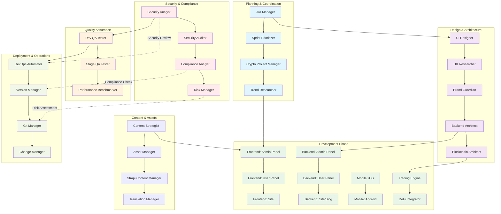
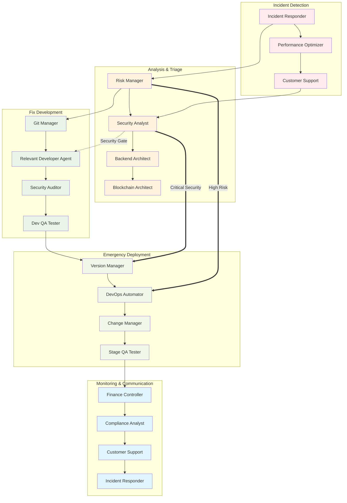
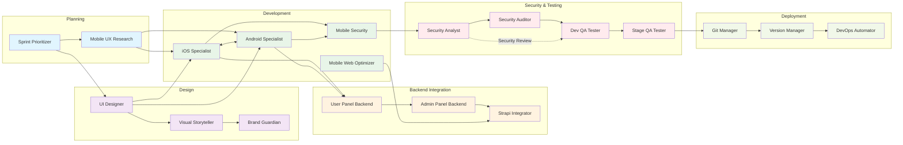
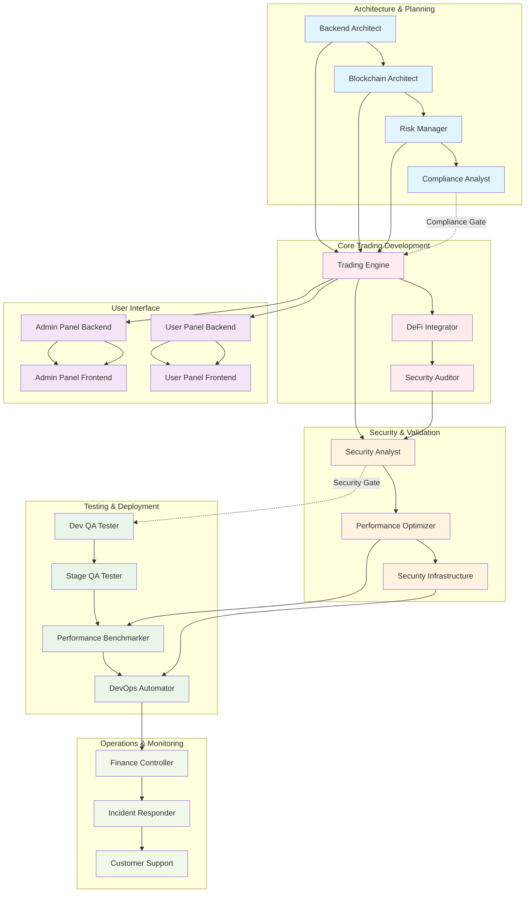
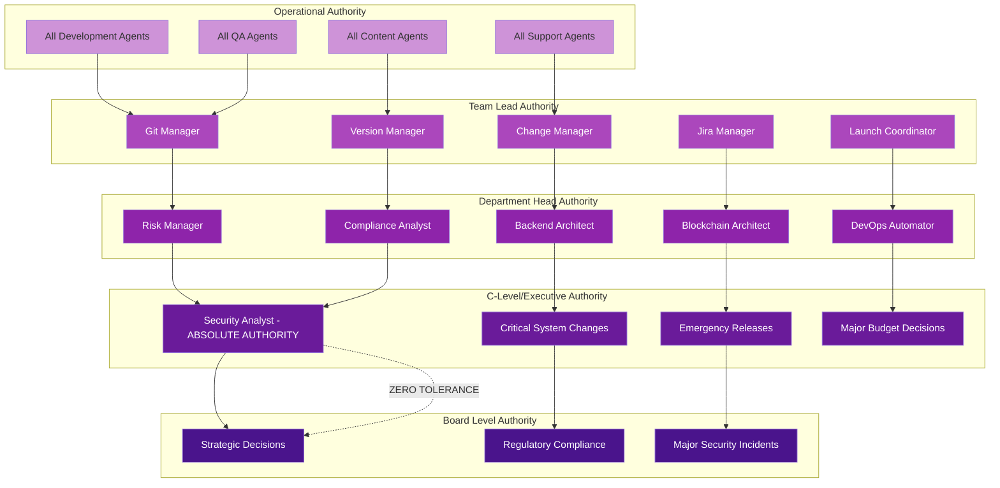
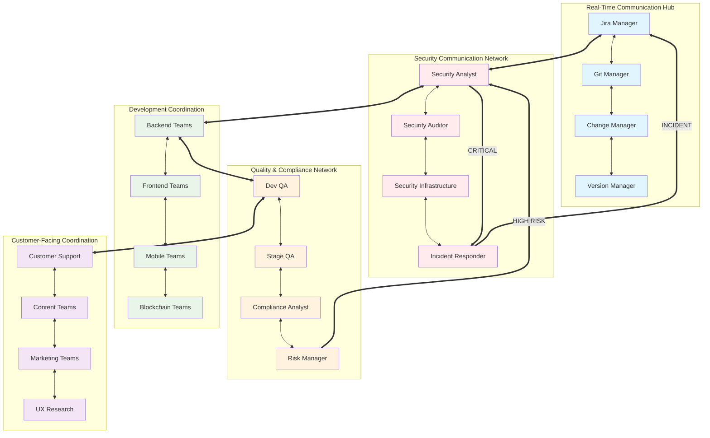

# Crypto Exchange Agent Workflow Diagrams
**Version**: 1.2
**Last Updated**: 2024-12-26

## 📊 Agent Relationship & Workflow Diagrams

This document provides comprehensive workflow diagrams showing how all 41 crypto exchange agents interact, coordinate, and collaborate across different types of development tasks.

---

## 🏗️ **1. New Feature Development Workflow**

---

## 🔧 **2. Bug Fix & Hotfix Workflow**

---

## 📱 **3. Mobile App Development Workflow**

---

## 🏦 **4. Trading System Development Workflow**

---

## 🔄 **5. DevOps & Infrastructure Workflow**

```mermaid
graph LR
    subgraph "Infrastructure Planning"
        A[DevOps Automator] --> B[Security Infrastructure]
        B --> C[Performance Optimizer]
    end

    subgraph "Version Control"
        D[Git Manager] --> E[Version Manager]
        E --> F[Change Manager]
    end

    subgraph "Security Gates"
        G[Security Analyst] --> H[Security Auditor]
    end

    subgraph "Quality Assurance"
        I[Dev QA Tester] --> J[Stage QA Tester]
        J --> K[Performance Benchmarker]
    end

    subgraph "Deployment Pipeline"
        L[Launch Coordinator] --> M[Infrastructure Maintainer]
    end

    subgraph "Monitoring & Operations"
        N[Incident Responder] --> O[Finance Controller]
        O --> P[Customer Support]
    end

    %% Infrastructure setup
    A --> D
    B --> G
    C --> I

    %% Version control flow
    D --> G
    F --> G

    %% Security gates (critical path)
    G -.->|Security Approval| I
    H -.->|Security Validation| J

    %% Deployment flow
    K --> L
    L --> N

    %% Continuous monitoring
    M --> N

    classDef infrastructure fill:#e1f5fe
    classDef version fill:#f3e5f5
    classDef security fill:#ffebee
    classDef qa fill:#e8f5e8
    classDef deployment fill:#fff3e0
    classDef monitoring fill:#f1f8e9

    class A,B,C infrastructure
    class D,E,F version
    class G,H security
    class I,J,K qa
    class L,M deployment
    class N,O,P monitoring
```

---

## 🎯 **6. Agent Authority & Escalation Matrix**

---

## 📊 **7. Communication & Coordination Matrix**

---

## 🔄 **8. Continuous Integration/Deployment Flow**

```mermaid
graph LR
    subgraph "Development"
        A[Developer Agent] --> B[Git Manager]
        B --> C[Security Analyst]
    end

    subgraph "Automated Testing"
        D[Dev QA Tester] --> E[Performance Benchmarker]
        E --> F[Security Auditor]
    end

    subgraph "Staging"
        G[Stage QA Tester] --> H[Version Manager]
        H --> I[Change Manager]
    end

    subgraph "Production Deployment"
        J[DevOps Automator] --> K[Infrastructure Maintainer]
        K --> L[Incident Responder]
    end

    subgraph "Monitoring & Support"
        M[Performance Optimizer] --> N[Customer Support]
        N --> O[Finance Controller]
    end

    %% CI/CD Pipeline Flow
    A --> D
    C -.->|Security Gate| D

    F --> G
    I --> J

    L --> M

    %% Feedback loops
    N -.->|Issues| A
    O -.->|Metrics| H
    M -.->|Performance| E

    %% Critical gates
    C -.->|BLOCKS ON SECURITY| X[STOP]
    F -.->|SECURITY VALIDATION| G

    classDef development fill:#e8f5e8
    classDef testing fill:#fff3e0
    classDef staging fill:#e1f5fe
    classDef production fill:#f1f8e9
    classDef monitoring fill:#f3e5f5
    classDef stop fill:#ffebee

    class A,B,C development
    class D,E,F testing
    class G,H,I staging
    class J,K,L production
    class M,N,O monitoring
    class X stop
```

---

## 📈 **Key Workflow Principles**

### **🔒 Security-First Architecture**

- **Security Analyst** has **ABSOLUTE AUTHORITY** at all gates
- **Zero-tolerance policy** - ANY security risk blocks progress
- **Multiple security validation points** throughout all workflows

### **🔄 Parallel Development Support**

- **Multi-branch workflows** support simultaneous development
- **Cross-platform coordination** between iOS/Android teams
- **Independent deployment pipelines** with synchronized releases

### **📊 Real-Time Coordination**

- **Jira Manager** coordinates all task lifecycles
- **Git Manager** manages branch strategies automatically
- **Change Manager** notifies ALL affected services

### **🏆 Quality Gates**

- **Performance validation** at multiple checkpoints
- **Compliance verification** before any release
- **Risk assessment** integrated throughout workflows

### **🚀 Enterprise Scalability**

- **Authority matrices** scale with organization size
- **Communication protocols** support global teams
- **Monitoring systems** provide real-time visibility

---

## 💡 **Usage Instructions**

1. **For Development Teams**: Follow the feature development workflow for new functionality
2. **For Operations Teams**: Use the DevOps workflow for infrastructure management
3. **For Security Teams**: Reference the escalation matrix for incident response
4. **For Management**: Monitor through the communication matrix dashboards

Each workflow ensures **enterprise-grade security**, **regulatory compliance**, and **operational excellence** while maintaining the **6-day sprint velocity** for rapid crypto exchange development.
